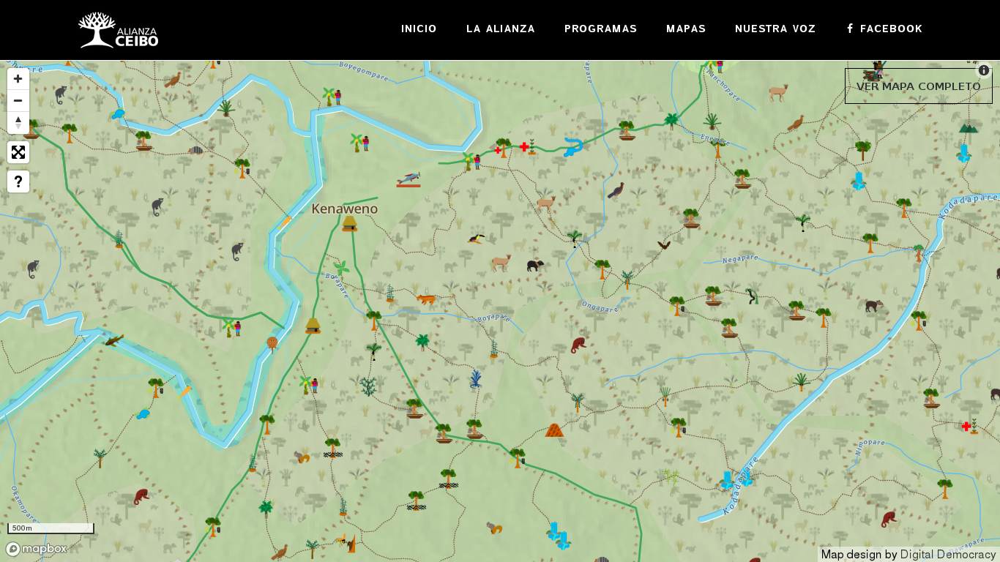

# offline p2p mapping

data synchronization in disconnected environments

https://github.com/substack/jsconfhi2019-offline-p2p-mapping

---
# bio

* https://substack.net
* member of bits.coop

working with digital democracy (ddem) since 2015

---
# ddem local partners


* guyana: South Rupununi District Council (SRDC)
* ecuador: Alianza Ceibo (A'i Kofan, Siekopai, Siona, and Waorani)

---
# srdc issues

from wapichan environmental monitoring report:

* Between 2013-2018, our monitors have made more than 250 observations of
  activities that are harmful, illegal, and/or violations of our rights.

* Between  2013-2018,  our  monitors  have  observed  more  than  380  impacts
  on  the  environment and our way of life, including deforestation, water
  pollution, destruction of hunting and fishing grounds, and damage to cultural
  heritage, among others.

* Almost 50% of the impacts observed by monitors are caused by mining activities.

http://wapichanao.communitylands.org/1548691773093-wapichan-environmental-monitoring-report-2018-v2.pdf

---

Ron James, a community mapper involved in the monitoring project explains:

By mapping the mining pollution sources we now understand how it affects wider
river systems and water supplies that are essential to our villages for fishing,
bathing and drinking. The headwaters of the Kwitaro, Kuyuwini and Takatu Rivers
are under serious threat. We are bringing this monitoring information to the
attention of the environmental and mining authorities, yet the problem continues
unabated.

http://wapichanao.communitylands.org/1505782363043-srdc-press-release-sept-19-community-monitorig-and-web-site-news-pdf.pdf

---
# srdc mapping project

"Work started in 2000 to map our traditional occupation and use of the land using
our own mappers who worked closely with our communities and holders of
traditional knowledge. This was followed in 2005-06 by a community-based
research project to document our traditional practices and our ways of caring
for our land and resources. On completion of that work, our District Toshaos
Councils (DTCs) agreed in December 2007 to develop an outline plan for caring
for our territory. This latest work has been carried out by our people in large
part in response to a request made by the President of Guyana in 2004 asking our
leaders to show how we intend to use, care for and develop our lands."

http://wapichanao.communitylands.org/aboutus.html

---
# waorani territorial defense

“We are Waorani and we have always lived in the Amazon rainforest. Drilling
for oil within our territory threatens everything that matters for our
people. We do not recognize what the government calls Oil Block 22.

“Our forest homeland is not an oil block, it is our life.

“Our message to the oil companies: Our land is not for sale.”

---
# waorani territorial mapping



https://www.alianzaceibo.org/mapas/waorani/

---
# tech needs

* inform local decision-making
* gather and organize evidence
* present information for talks with governments and outside groups
* preserve traditional knowledge

---
# tech needs: territory mapping

* overlay satellite imagery, land titles
* record significant settlements, farms, pastures, hunting grounds, sacred
  sites, wildlife, plants with important uses
* produce maps for press and negotiations with government
* use plotters to make paper copies
* document cultural knowledge and stories from elders and
  specialized knowledge holders

---
# tech needs: environmental monitoring

* take photographs and video
* gps coordinates
* text and voice description
* drone footage

---
# shortfalls of existing mapping technology

* difficult to learn, limited expertise
* not designed for community collaboration
* online assumptions

---
# tech challenges

* power sources: solar, generators, vehicles
* internet access: satellite with data caps, some cell phone service
* hardware durability: water, ants

---
# mapping considerations

* collect and organize environmental monitoring evidence
* work offline
* easy to learn + teach (not dependent on external experts)
* customizable for many languages and icons
* map presets based on what's important to local communities

---
# tools

"Technology changes every day, and I’d like to learn more about developing
software and writing commands because right now we are dependent on people
coming from the outside to do this for us."

-- Tessa Josephs, Monitoring Coordinator, South Rupununi District Council

---
# choosing what to share

data belongs to communities

they get to decide how it's used and what to share

---
# data transfer options

* internet
* usb drives
* local offline wifi router
* wifi hotspot on a smartphone
* bluetooth
* adb (laptop <=> smartphone)

---
# why p2p?

* no critical privileged devices
* many devices making writes offline
* every peer has a local offline backup
  (important for local decision-making)
* gossip networks can take advantage of many transfer options

---
# why p2p: implicit backups!

* devices break
* devices fall in the river
* devices are lost

devices have full or partial read/write replicas of the data,
like git repos

---
# mapeo

* desktop and mobile
* idEditor
* osm-p2p-db
* osm-p2p-server

---
# offline p2p

kappa architecture:

* append-only log
* materialized views

---
# open street map data model

nodes:

* id, lon, lat, tags

ways:

* id, tags, refs

relations:

* id, tags, members

---
# open street map xml: nodes

```
<node id="242840499" lat="18.3484131" lon="-114.7598564" version="2"
  timestamp="2014-05-13T19:47:00Z" changeset="22320262" uid="31231"
  user="Andre68"/>
<node id="242840501" lat="18.3457056" lon="-114.7596656" version="2"
  timestamp="2014-05-13T19:47:00Z" changeset="22320262" uid="31231"
  user="Andre68"/>
```

---
# open street map xml: ways

```
<way id="318442047" version="1" timestamp="2014-12-22T22:07:45Z"
changeset="27640096" uid="2160092" user="kg4sgp">
  <nd ref="3248467271"/>
  <nd ref="3248467274"/>
  <nd ref="3248467276"/>

  ...

  <nd ref="3248467273"/>
  <nd ref="3248467272"/>
  <nd ref="3248467270"/>
  <nd ref="3248467269"/>
  <nd ref="3248467271"/>
  <tag k="natural" v="beach"/>
</way>
```

---
# open street map xml: relations

```
<relation id="5300072" version="1" timestamp="2015-06-19T17:29:46Z"
changeset="32080377" uid="203688" user="jorge_o">
  <member type="way" ref="354914848" role="outer"/>
  <member type="way" ref="22636870" role="outer"/>
  <tag k="name" v="Isla Clarión"/>
  <tag k="type" v="multipolygon"/>
  <tag k="place" v="island"/>
  <tag k="wikidata" v="Q1095657"/>
</relation>
```

---
# p2p-ified open street map: ids

before: monotonically incrementing ids

```
<node id="840172" ... />
```

after: sufficiently long random id strings

```
<node id="38022134902476958748" ... />
```

so that multiple devices are very unlikely to
simultaneously generate the same ID

---
# p2p-ified open street map: versions

before: monotonically incrementing versions

```
<node version="2" ... />
```

after: cryptographic hash or log sequences

```
<node version="caf58143f34412b1@55" ... />
```

---
# osm-p2p: first iteration

append-only log:

* hyperlog (early dat project prototype component)

materialized views:

* hyperkv
* hyperlog-kdb-index
* hyperlog-join

---
# osm-p2p: first iteration lessons

* batch write performance

15 minutes to sync to a new device with ~250k records

* untangling normalized historical data

---
# osm-p2p - second iteration (kappa-osm)

append-only log:

* hypercore (dat project core component)

materialized views managed by kappa-core:

* unordered-materialized-bkd / bkd-tree
* unordered-materialized-kv
* unordered-materialized-backrefs

everything designed for large batches

---
# unordered materialized views

converge to the same state no matter the order of documents received

(CRDT techniques)

future applications: sparse replication and encryption workflows

---
# p2p key/value store linear example

```
{ id: "x@0", key: "A", value: 5, links: [] }       // A=5
{ id: "x@1", key: "A", value: 6, links: ["x@0"] }  // A=6
{ id: "y@0", key: "A", value: 7, links: ["x@1"] }  // A=7
{ id: "x@2", key: "A", value: 8, links: ["y@0"] }  // A=8
```

---
# p2p key/value store forking/merge example

```
{ id: "x@0", key: "A", value: 10, links: [] }            // A=10
{ id: "x@1", key: "A", value: 11, links: ["x@0"] }       // A=11
{ id: "y@0", key: "A", value: 12, links: ["x@0"] }       // A=11,12
{ id: "x@2", key: "A", value: 13, links: ["x@1","y@0"] } // A=13
```

---
# p2p key/value store out of order forking/merge example

```
{ id: "y@0", key: "A", value: 12, links: ["x@0"] }       // A=12
{ id: "x@2", key: "A", value: 13, links: ["x@1","y@0"] } // A=13
{ id: "x@1", key: "A", value: 11, links: ["x@0"] }       // A=13
{ id: "x@0", key: "A", value: 10, links: [] }            // A=13
```

---
# spatial index

bkd tree backed by abstract-random-access

* optimized for bulk write performance
* forest of log structured merge trees

```
                       /\
               /\     /  \    ...
         /\   /  \   /    \
/\ | /\ /__\ /____\ /______\
 1 |  1   2    4       8      ...
```

---
# future work

* encrypted remote backups / collaboration
* knowing which pieces of data are backed up
* sparse replication of built indexes

---
# future work: peermaps

https://peermaps.org/

* eyros - p2p spatial index (interval trees) for rolling updates
* cooperative (seti@home style) batch processing and seeding of planet.osm
* database designed for directly rendering query results with webgl (not tiles)
* offline path planning
* p2p distribution of satellite imagery

---

"We Waorani like Mapeo because it is an open program and it’s not too difficult
to learn. It’s been really helpful to us to allow us to manage our own mapping
program, and for the first time people in all the villages, including the local
technicians but also even the elders who don’t speak Spanish or know how to read
have been able to understand it. It is also the first programme we’ve ever seen
where we can our own icons for things and for it to be in our own language,
rather than in English or in Spanish."

"With Mapeo we have, for the first time, a tool that we can use to make our own
maps, and we can build a strong team of people who can train others to map. The
mapping project has united many villages to defend and manage their lands
together. And it is a process which is leaving a legacy for the future, both the
maps and the skills, that our people can use to fight for our livelihoods and
our rights."

-- Oswando Nenquimo (Opi), Director of the Waorani Mapping Project

---
# links: alianza ceibo and wapichan partners

* https://www.alianzaceibo.org/
* http://wapichanao.communitylands.org/
* https://www.revistadelauniversidad.mx/articles/15aa78e7-d712-4ae5-8daf-9431390313bd/mapeo-territorial-waorani
* https://waoresist.amazonfrontlines.org/explore/

* https://www.alianzaceibo.org/mapas/waorani/
* https://www.alianzaceibo.org/mapas/siekopai/

* https://twitter.com/UnistotenCamp/status/1071528092328321024 - statement of
  solidarity from cofan member and UDAPT coordinator william lucitante
  to unist'ot'en (http://unistoten.camp/)
* https://www.youtube.com/watch?v=cbb45dQDbQI - AJE segment on waorani
* https://www.facebook.com/AlianzaCeiboAmazonia

---
# links: kanaka maoli led activism

* https://www.facebook.com/protectmaunakea / #aoleTMT
* https://therednation.org/2015/08/03/la-hoihoi-ea-politics-of-restoration-and-hawaiian-sovereignty/
* [Pohakuloa Training Area plans slammed by Hawaiians, activists (Nov. 2011)](https://www.youtube.com/watch?v=15HosQNzcxo)
* [ARCHIVES: Hawaiian Language Stirs Up Courts - (Jan. 28, 2018)](https://www.youtube.com/watch?v=JSCV3G_BB5I)

---
# links: offline p2p technology

* https://mapeo.world/
* https://digital-democracy.org/
* https://peermaps.org/
* https://datproject.org/

* https://github.com/kappa-db/kappa-core
* https://noffle.github.io/kappa-arch-workshop/

* https://users.cs.duke.edu/~pankaj/publications/papers/bkd-sstd.pdf

* https://github.com/peermaps/eyros
* https://github.com/peermaps/mixmap

* https://www.digital-democracy.org/blog/openstreetmap-without-servers/
* https://www.digital-democracy.org/blog/osm-p2p/

* https://github.com/digidem/mapeo-desktop
* https://github.com/digidem/mapeo-mobile

* https://github.com/digidem/kappa-osm
* https://github.com/digidem/osm-p2p-db
* https://github.com/digidem/osm-p2p-server

---

__END__
